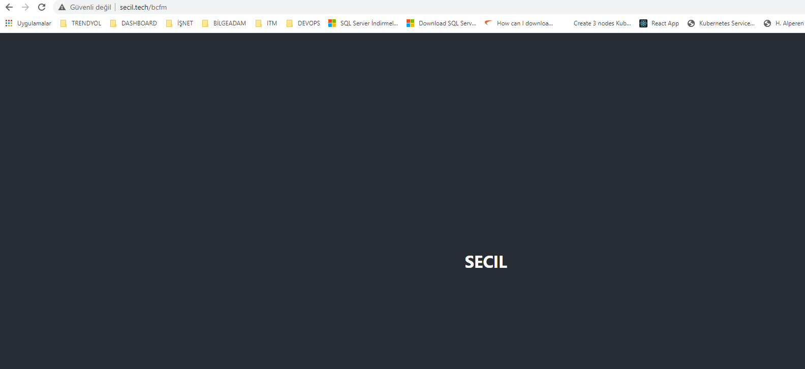
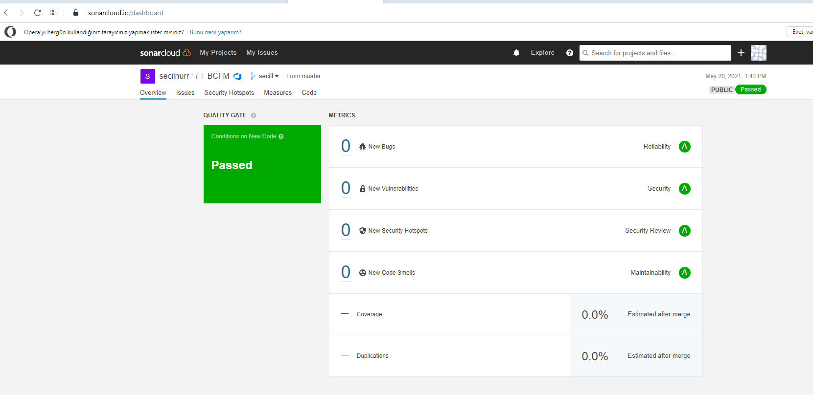
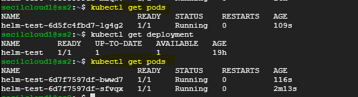

# ReacApp
## Local Execution

In the project directory, you can run (Local):

### `cd react-app`

### `npm install react-scripts`

### `npm start`


http://localhost:3000/bcfm



# CI-CD / Azure Devops - https://dev.azure.com/secilnurr/BCFM

* Commit Atıldığında Pipeline tetiklenmesi aşağıdaki şekilde sağlanmıştır.

  
  
* Pipeline Sonar Qube Taramasından Geçirilmiştir.
  
  
  
* Quality Gate Check 

  
  
* Helm Deploy
  
```
helm upgrade bhelm  $(System.DefaultWorkingDirectory)/_BCFM/helm --reuse-values --set containers.imageName=secilns/bcfm:$(Build.BuildId)v
```
* Auto Scale

 
 
 # Uygulama secil.tech uzerinden load balancer'a yönlendirilmiştir.

* http://secil.tech/bcfm
* docker pull secilns/bcfm:127v


